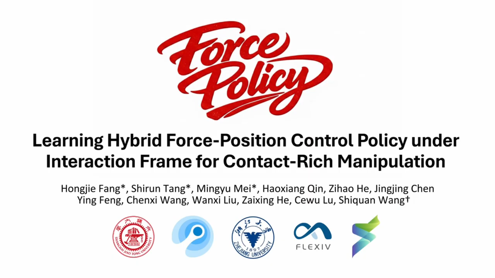
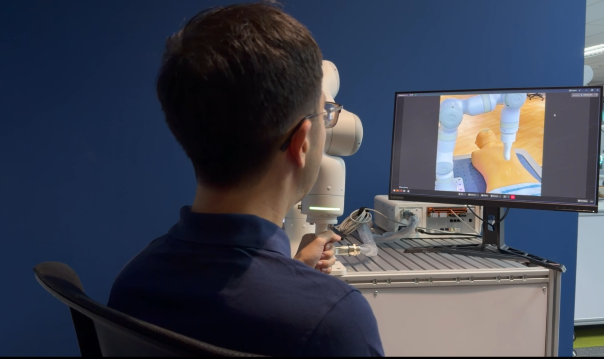
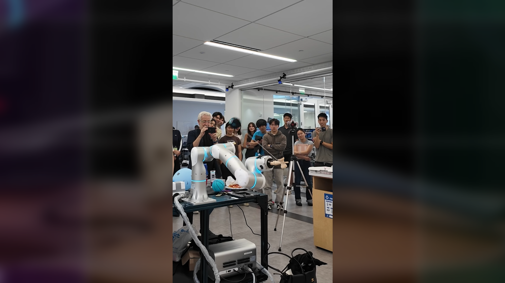
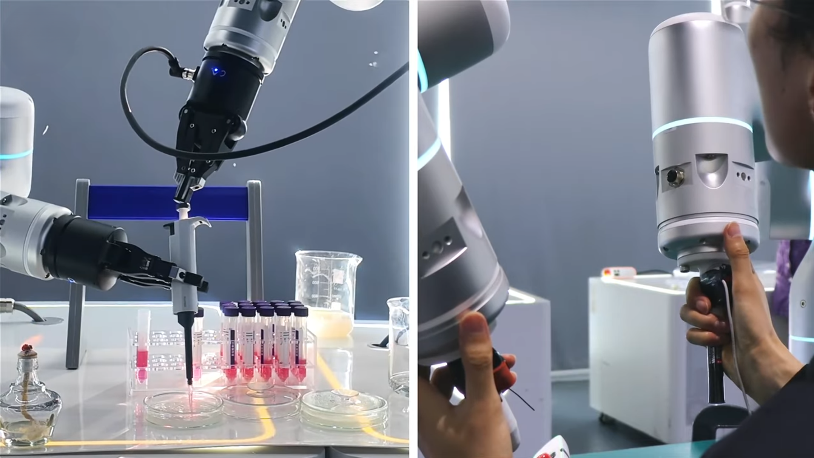

# Flexiv's TDK | Teleoperation Made Simple

Welcome to the **Flexiv TDK (Teleoperation Development Kit)** documentation site. This site provides a user manual, API reference, and Q&A to help you setup and integrate TDK.

## What is Flexiv TDK?

Flexiv TDK is an SDK for building custom robot-to-robot or device-to-robot teleoperation applications with Flexiv's adaptive robots. It enables synchronized, force-guided motion using **high-fidelity perceptual feedback** and supports both **LAN** (Local Area Network) and **WAN** (Internet) connections. 

TDK boasts a wide range of application scenarios in fields including Embodied AI Data Acquisition, radiation medicine, and hazardous chemical experiments.

## TDK in Real-World Applications

  

  

  <button class="tdk-carousel-btn tdk-carousel-prev" aria-label="Previous image">&#8249;</button>
  <button class="tdk-carousel-btn tdk-carousel-next" aria-label="Next image">&#8250;</button>
  

🎬 **[Flexiv's TDK | Teleoperation Made Simple](https://www.youtube.com/watch?v=H0e9FSZIa14)**  

  
  

## Contact-Rich Manipulation Benchmarks
Flexiv TDK has been recognized on the [Manipulation Net Peg-in-Hole Leaderboard](https://manipulation-net.org/leaderboards/peg_in_hole.html). The [Manipulation Net](https://manipulation-net.org) is a public benchmark for robotic manipulation in the real world at scale with any robot at any time and anywhere. This provides external evidence for the contact-rich manipulation capability relevant to TDK use cases, including compliant insertion, alignment, and force-sensitive teleoperation workflows.

## Key Features
- **High Fidelity Perceptual Feedback**: 100% tactile feedback transparency ensures the fidelity of human operation.
- **Cross-border long-distance teleoperation**: Flexible network configurations for both LAN and WAN.
- **Better Physical Human-Robot Interaction**: The leader robot can be repositioned or reoriented at any time. Upon re-engagement, only relative motion is mapped—no absolute pose constraints.
- **Selective Cartesian Constraints**: Constrain motion along specific directions for faster, more precise task execution.
- **Robust Force/Moment Protection**: Prevents damage to the robot and workpiece while ensuring intrinsic safety during contact.

## Quick Links
- [User Manual](user-manual/overview.md)
- [API Reference](api/doxygen/index.html)
- [Q&A](qa/index.md)
- [GitHub Repository](https://github.com/flexivrobotics/flexiv_tdk)

## Documentation Structure
- **User Manual**: Setup, installation and operational guidance.
- **API Reference**: Doxygen-generated C++ API documentation.
- **Q&A**: Common questions and troubleshooting tips.

> Note: The API reference is generated via Doxygen and published on GitHub Pages together with this site.
