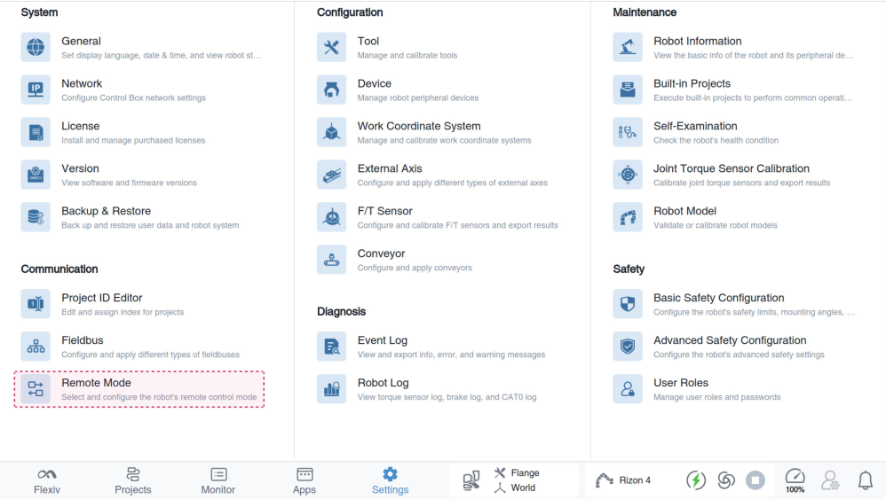
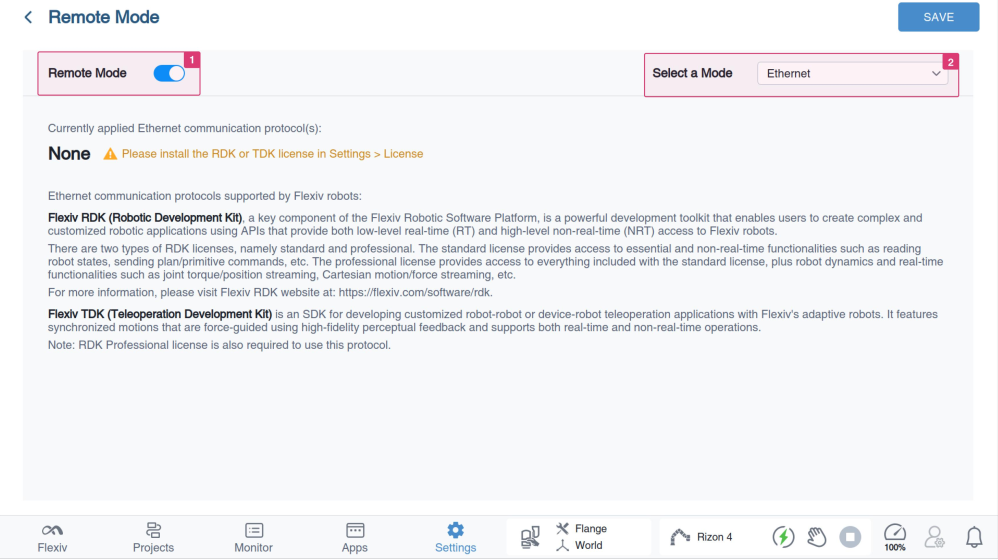
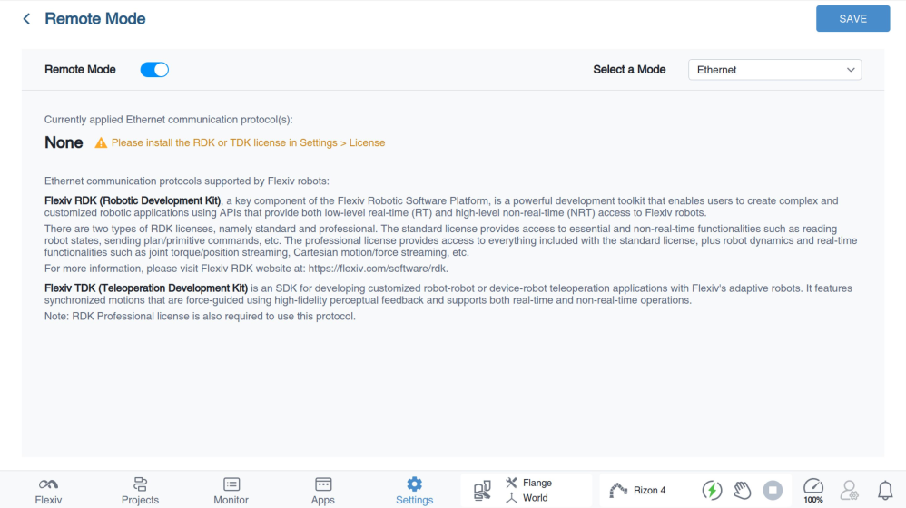
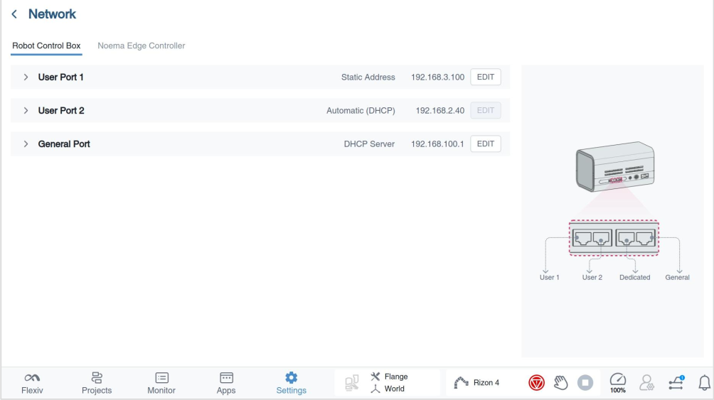

# Robots setup and network configuration
Before using TDK, robot needs to be properly installed and the network configured. TDK can be adapted to both local area networks (LAN) and wide area networks (WAN). The following will take a LAN as an example to explain how to set up the robot network and the user computer network.

## ⚠️ Important
Please make sure all robots are well mounted on a fixed base and are powered on before proceeding to the next step.

## Step 1: Power on and servo on the robots
Follow instructions in the provided Quick Start Guide to complete hardware setup and boot up the two robots. After booting up, connect the robots to the UI tablet (Flexiv Elements). All the light rings on the robots should be deep blue if they are powered on and servo on.

## Step 2: Enable Remote Mode - Ethernet

Go to Settings > Remote Mode on the Flexiv Elements.

To enable Remote Mode, turn on the toggle, then select Ethernet from the Select a Mode drop-down list

View the currently applied Ethernet communication protocol(s). If no license has been installed, you can install the TDK license in Settings >
License.

## Step 3: Configure the network for leader robot and follower robot

The network configuration for the leader robot and follower robot can be done via the ``Flexiv Elements->Settings->Network``.
Please refer to Flexiv Elements User Manual for more details.

For LAN teleoperation, please set both robots and the user's computer to the same network segment with different IP Addresses (e.g., leader robot: 192.168.2.110, follower robot: 192.168.2.111 and user PC:192.168.2.112. All configured with a subnet mask of 255.255.255.0).

## Step 4: Reboot the robots and ping test
After configuring the network and remote mode, reboot the robots. Connect the user's computer and two robots to the same ethernet switch. Ping the two control boxes to make sure all the devices are connected properly.

