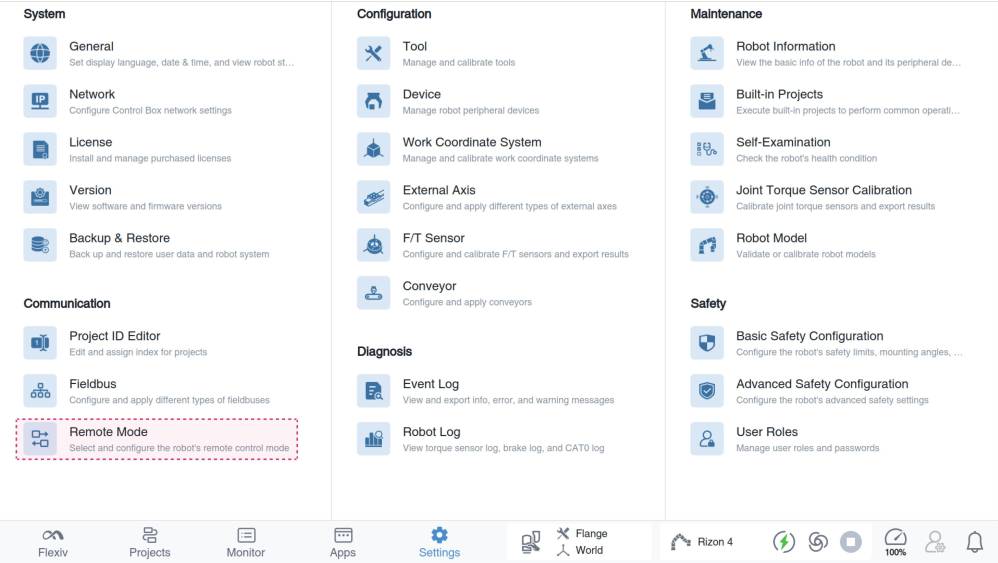
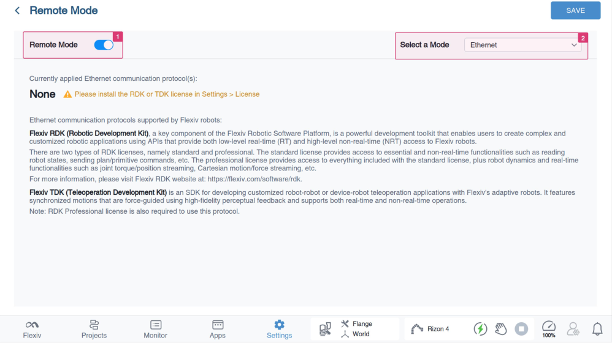
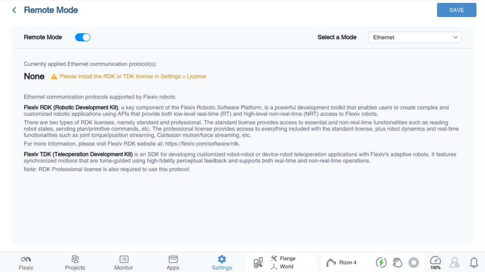
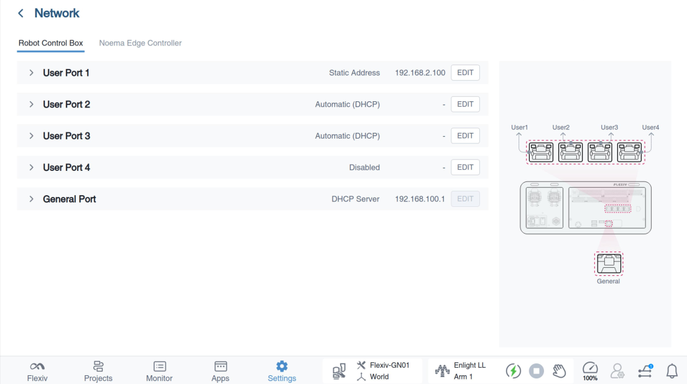

# 機器人設定與網路配置

!!! warning "注意"

    在繼續之前，請確保機器人牢固安裝在穩固的基座上，在高速運動並急停時不會傾覆。

TDK 同時支援區域網路（LAN）和廣域網路（WAN）部署。本節以 LAN 部署為例，介紹機器人和使用者電腦的網路配置。

## 第 1 步：機器人上電並致能

按照隨附的《快速入門指南》完成硬體安裝並啟動兩台機器人。啟動後，將機器人連接到 UI 平板（Flexiv Elements）。機器人上電並致能後，所有燈環應呈深藍色。

## 第 2 步：啟用遠端模式 - Ethernet

在 Flexiv Elements 上進入「設定 > 遠端模式」。

要啟用遠端模式，打開開關，然後從「選擇模式」下拉清單中選擇 Ethernet。

查看目前已套用的乙太網路通訊協定。如果尚未安裝授權，可以在「設定 > 授權」中安裝 TDK 授權。

## 第 3 步：配置主端和從端機器人的網路

主端機器人和從端機器人的網路配置可透過 ``Flexiv Elements->設定->機器人控制箱`` 完成。
更多詳情請參閱《Flexiv Elements 使用者手冊》。

對於 LAN 遙操作，請將主端機器人、從端機器人和使用者電腦設定在同一網段並使用不同的 IP 位址（例如：主端機器人 192.168.2.110，從端機器人 192.168.2.111，使用者電腦 192.168.2.112，子網路遮罩均為 255.255.255.0）。

## 第 4 步：重啟機器人並 ping 測試

完成網路和遠端模式配置後，重啟機器人。將使用者電腦和兩台機器人連接到同一個乙太網路交換器。Ping 兩個控制箱，確認所有設備連接正常。

## 第 5 步：工具標定

按照《Flexiv Elements 使用者手冊》中「工具標定」章節，確保兩台機器人上工具的慣量參數都已標定，且所配置的工具確實是目前使用的工具。將主端機器人的 TCP 位置設定在人手實際握持的位置。
